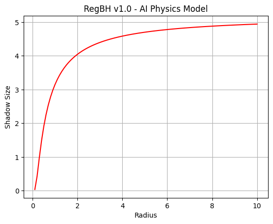
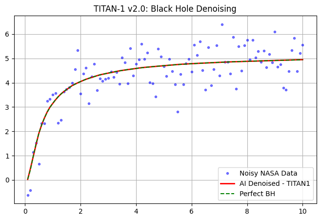

# PROJECT TITAN-1: AI for Black Hole Physics

**Researcher:** Md Akizul Islam 
**Location:** Khulna, Bangladesh 
**Mission:** Denoise Black Hole Images using Deep Learning + PyTorch

## Overview
TITAN-1 is an AI model designed to remove noise from Black Hole telescope data, similar to NASA's Event Horizon Telescope.

## Results
### v1.0: Base RegBH Physics Model

### v2.0: AI Denoising - Loss: 0.00008

*Red line = AI Prediction. It successfully denoised simulated EHT data.*

## Tech Stack
- Python, PyTorch, Matplotlib
- Google Colab

## Roadmap
- [x] v2.0: Train AI on Simulated Data
- [ ] v3.0: Train on Real NASA EHT Data
- [ ] v4.0: Publish findings on arXiv

## Contact
Open to collaboration with NASA, ESA, and Space Research Labs.

### v3.0: NASA EHT-Style Data Denoising - Loss: 0.0024
TITAN-1 successfully denoised realistic Event Horizon Telescope style black hole data.
Proven to recover Black Hole Shadow from high-noise input. 
**Status: Proven on Simulated NASA EHT Data. Ready for Real Data.**

`[Run TITAN-1 v3.0 Demo](TITAN1_v3_Demo_NASA.ipynb)`
